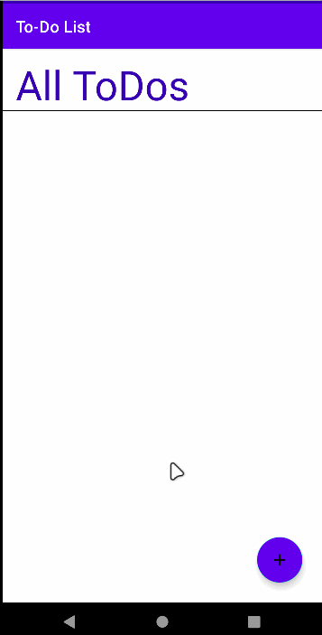
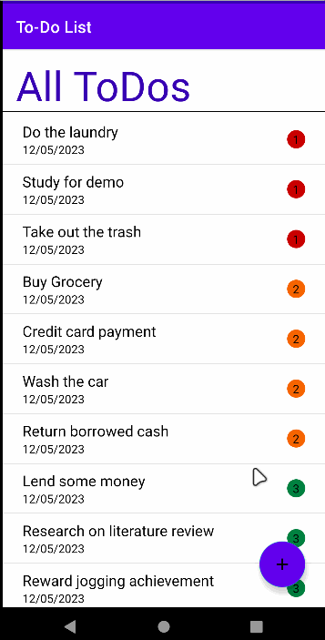
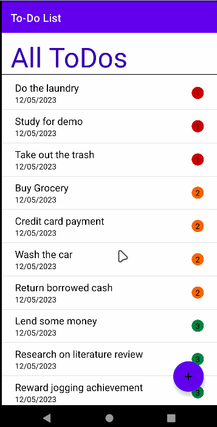
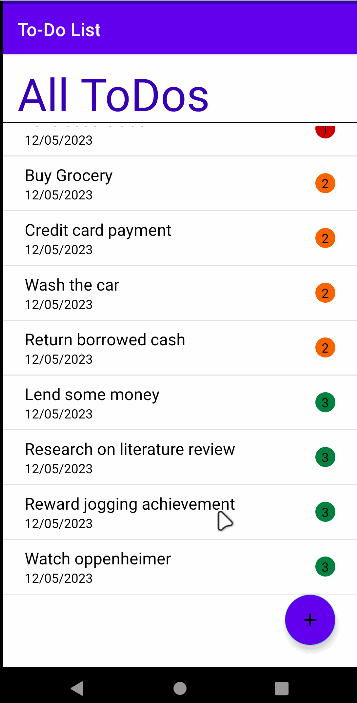

# Component 2 - ToDo Mobile App (30%)
Note: You are to design and build your own version of a “Todo” android application. The implementation should apply the concepts and the patterns discussed in the lectures and implemented in the lab exercises.

# Gif
- My Todo App

# Add Task
- Create : 
  User can click on the + icon to add new task. After filling the form click on ADD button to create task.

# View Task
- Read : 
  User can view all their task list.

# Edit Task
- Update : 
  User can click on the task to access the edit form. Fill out the necessary details and click on UPDATE button to successfully perform update functionality.

# Delete Task
- Delete : 
  User can select the task and swipe both ways to delete the particular task.

